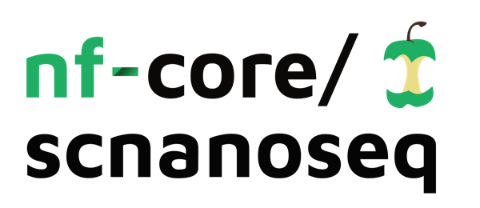
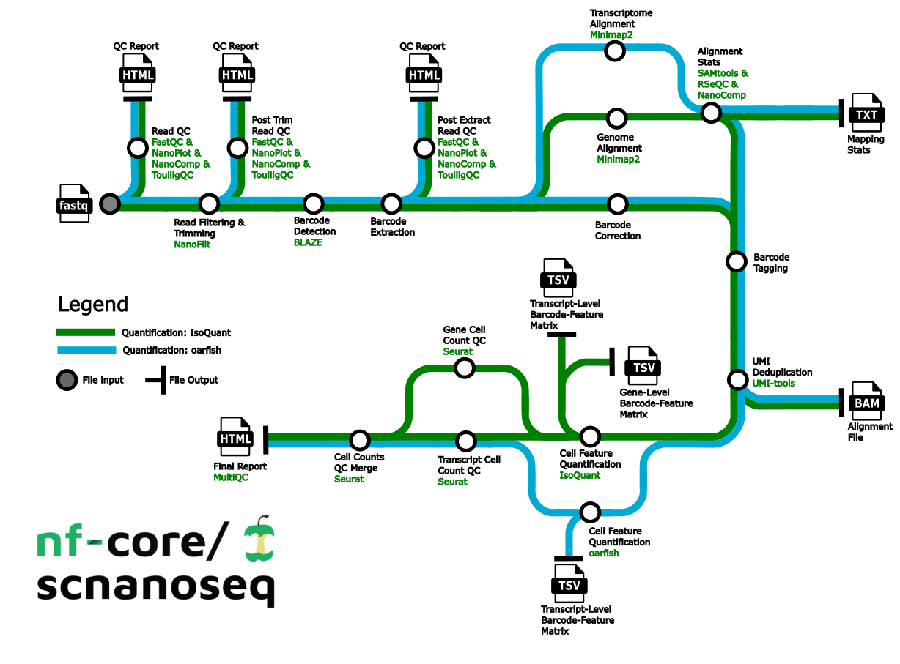

<h1>
  <picture>
    <source media="(prefers-color-scheme: dark)" srcset="docs/images/nf-core-scnanoseq_logo_dark.png">
    
  </picture>
</h1>

[](https://github.com/nf-core/scnanoseq/actions/workflows/ci.yml)
[](https://github.com/nf-core/scnanoseq/actions/workflows/linting.yml)[](https://nf-co.re/scnanoseq/results)[](https://doi.org/10.5281/zenodo.13899279)
[](https://www.nf-test.com)

[](https://www.nextflow.io/)
[](https://docs.conda.io/en/latest/)
[](https://www.docker.com/)
[](https://sylabs.io/docs/)
[](https://cloud.seqera.io/launch?pipeline=https://github.com/nf-core/scnanoseq)

[](https://nfcore.slack.com/channels/scnanoseq)[](https://twitter.com/nf_core)[](https://mstdn.science/@nf_core)[](https://www.youtube.com/c/nf-core)

## Introduction

**nf-core/scnanoseq** is a bioinformatics best-practice analysis pipeline for 10X Genomics single-cell/nuclei RNA-seq data derived from Oxford Nanopore Q20+ chemistry ([R10.4 flow cells (>Q20)](https://nanoporetech.com/about-us/news/oxford-nanopore-announces-technology-updates-nanopore-community-meeting)). Due to the expectation of >Q20 quality, the input data for the pipeline does not depend on Illumina paired data. **Please note `scnanoseq` can also process Oxford data with older chemistry, but we encourage usage of the Q20+ chemistry when possible**.

The pipeline is built using [Nextflow](https://www.nextflow.io), a workflow tool to run tasks across multiple compute infrastructures in a very portable manner. It uses Docker/Singularity containers making installation trivial and results highly reproducible. The [Nextflow DSL2](https://www.nextflow.io/docs/latest/dsl2.html) implementation of this pipeline uses one container per process which makes it much easier to maintain and update software dependencies. Where possible, these processes have been submitted to and installed from [nf-core/modules](https://github.com/nf-core/modules) in order to make them available to all nf-core pipelines, and to everyone within the Nextflow community!

On release, automated continuous integration tests run the pipeline on a full-sized dataset on the AWS cloud infrastructure. This ensures that the pipeline runs on AWS, has sensible resource allocation defaults set to run on real-world datasets, and permits the persistent storage of results to benchmark between pipeline releases and other analysis sources. The results obtained from the full-sized test can be viewed on the [nf-core website](https://nf-co.re/scnanoseq/results).

## Pipeline summary



1. Raw read QC ([`FastQC`](https://www.bioinformatics.babraham.ac.uk/projects/fastqc/), [`NanoPlot`](https://github.com/wdecoster/NanoPlot), [`NanoComp`](https://github.com/wdecoster/nanocomp) and [`ToulligQC`](https://github.com/GenomiqueENS/toulligQC))
2. Unzip and split FASTQ ([`pigz`](https://github.com/madler/pigz))
   1. Optional: Split FASTQ for faster processing ([`split`](https://linux.die.net/man/1/split))
3. Trim and filter reads ([`Nanofilt`](https://github.com/wdecoster/nanofilt))
4. Post trim QC ([`FastQC`](https://www.bioinformatics.babraham.ac.uk/projects/fastqc/), [`NanoPlot`](https://github.com/wdecoster/NanoPlot), [`NanoComp`](https://github.com/wdecoster/nanocomp) and [`ToulligQC`](https://github.com/GenomiqueENS/toulligQC))
5. Barcode detection using a custom whitelist or 10X whitelist. ([`BLAZE`](https://github.com/shimlab/BLAZE))
6. Extract barcodes. Consists of the following steps:
   1. Parse FASTQ files into R1 reads containing barcode and UMI and R2 reads containing sequencing without barcode and UMI (custom script `./bin/pre_extract_barcodes.py`)
   2. Re-zip FASTQs ([`pigz`](https://github.com/madler/pigz))
7. Barcode correction (custom script `./bin/correct_barcodes.py`)
8. Post-extraction QC ([`FastQC`](https://www.bioinformatics.babraham.ac.uk/projects/fastqc/), [`NanoPlot`](https://github.com/wdecoster/NanoPlot), [`NanoComp`](https://github.com/wdecoster/nanocomp) and [`ToulligQC`](https://github.com/GenomiqueENS/toulligQC))
9. Alignment to the genome, transcriptome, or both ([`minimap2`](https://github.com/lh3/minimap2))
10. Post-alignment filtering of mapped reads and gathering mapping QC ([`SAMtools`](http://www.htslib.org/doc/samtools.html))
11. Post-alignment QC in unfiltered BAM files ([`NanoComp`](https://github.com/wdecoster/nanocomp), [`RSeQC`](https://rseqc.sourceforge.net/))
12. Barcode (BC) tagging with read quality, BC quality, UMI quality (custom script `./bin/tag_barcodes.py`)
13. Read deduplication ([`UMI-tools`](https://github.com/CGATOxford/UMI-tools) OR [`Picard MarkDuplicates`](https://broadinstitute.github.io/picard/))
14. Gene and transcript level matrices generation with [`IsoQuant`](https://github.com/ablab/IsoQuant) and/or transcript level matrices with [`oarfish`](https://github.com/COMBINE-lab/oarfish)
15. Preliminary matrix QC ([`Seurat`](https://github.com/satijalab/seurat))
16. Compile QC for raw reads, trimmed reads, pre and post-extracted reads, mapping metrics and preliminary single-cell/nuclei QC ([`MultiQC`](http://multiqc.info/))

## Usage

> [!NOTE]
> If you are new to Nextflow and nf-core, please refer to [this page](https://nf-co.re/docs/usage/installation) on how to set-up Nextflow. Make sure to [test your setup](https://nf-co.re/docs/usage/introduction#how-to-run-a-pipeline) with `-profile test` before running the workflow on actual data.

First, prepare a samplesheet with your input data that looks as follows:

```csv title="samplesheet.csv"
sample,fastq,cell_count
CONTROL_REP1,AEG588A1_S1.fastq.gz,5000
CONTROL_REP1,AEG588A1_S2.fastq.gz,5000
CONTROL_REP2,AEG588A2_S1.fastq.gz,5000
CONTROL_REP3,AEG588A3_S1.fastq.gz,5000
CONTROL_REP4,AEG588A4_S1.fastq.gz,5000
CONTROL_REP4,AEG588A4_S2.fastq.gz,5000
CONTROL_REP4,AEG588A4_S3.fastq.gz,5000
```

Each row represents a single-end fastq file. Rows with the same sample identifier are considered technical replicates and will be automatically merged. `cell_count` refers to the expected number of cells you expect.

```bash
nextflow run nf-core/scnanoseq \
   -profile <docker/singularity/.../institute> \
   --input samplesheet.csv \
   --outdir <OUTDIR>
```

> [!WARNING]
> Please provide pipeline parameters via the CLI or Nextflow `-params-file` option. Custom config files including those provided by the `-c` Nextflow option can be used to provide any configuration _**except for parameters**_; see [docs](https://nf-co.re/docs/usage/getting_started/configuration#custom-configuration-files).

For more details and further functionality, please refer to the [usage documentation](https://nf-co.re/scnanoseq/usage) and the [parameter documentation](https://nf-co.re/scnanoseq/parameters).

## Pipeline output

This pipeline produces feature-barcode matrices as the main output. These feature-barcode matrices are able to be ingested directly by most packages used for downstream analyses such as `Seurat`. Additionally, the pipeline produces a number of quality control metrics to ensure that the samples processed meet expected metrics for single-cell/nuclei data.

The pipeline provides two tools to produce the aforementioned feature-barcode matrices, `IsoQuant` and `oarfish`, and the user is given the ability to choose whether to run both or just one. `IsoQuant` will require a genome fasta to be used as input to the pipeline, and will produce both gene and transcript level matrices. `oarfish` will require a transcriptome fasta to be used as input to the pipeline and will produce only transcript level matrices.

To see the results of an example test run with a full size dataset refer to the [results](https://nf-co.re/scnanoseq/results) tab on the nf-core website pipeline page.
For more details about the full set of output files and reports, please refer to the
[output documentation](https://nf-co.re/scnanoseq/output).

## Troubleshooting

If you experience any issues, please make sure to reach out on the [#scnanoseq slack channel](https://nfcore.slack.com/archives/C03TUE2K6NS) or [open an issue on our GitHub repository](https://github.com/nf-core/scnanoseq/issues/new/choose). However, some resolutions for common issues will be noted below:

- Due to the nature of the data this pipeline analyzes, some tools may experience increased runtimes. For some of the custom tools made for this pipeline (`preextract_fastq.py` and `correct_barcodes.py`), we have leveraged the splitting done via the `split_amount` parameter to decrease their overall runtimes. The `split_amount` parameter will split the input FASTQs into a number of FASTQ files, each containing a number of lines based on the value used for this parameter. As a result, it is important not to set this parameter to be too low as doing so would cause the creation of a large number of files the pipeline will be processed. While this value can be highly dependent on the data, a good starting point for an analysis would be to set this value to `500000`. If you find that `PREEXTRACT_FASTQ` and `CORRECT_BARCODES` are still taking long amounts of time to run, it would be worth reducing this parameter to `200000` or `100000`, but keeping the value on the order of hundred of thousands or tens of thousands should help with keeping the total number of processes minimal. An example of setting this parameter to be equal to 500000 is shown below:

```yml title="params.yml"
split_amount: 500000
```

- We have seen a recurrent node failure on slurm clusters that does seem to be related to submission of Nextflow jobs. This issue is not related to this pipeline per se, but rather to Nextflow itself. We are currently working on a resolution. But we have two methods that appear to help overcome should this issue arise:
  1. Provide a custom config that increases the memory request for the job that failed. This may take a couple attempts to find the correct requests, but we have noted that there does appear to be a memory issue occasionally with these errors.
  2. Request an interactive session with a decent amount of time and memory and CPUs in order to run the pipeline on the single node. Note that this will take time as there will be minimal parallelization, but this does seem to resolve the issue.
- We note that umitools dedup can take a large amount of time in order to perform deduplication. One approach we have implemented to assist with speed is to split input files based on chromosome. However for the transcriptome aligned bams, there is some additional work required that involves grouping transcripts into appropriate chromosomes. In order to accomplish this, the pipeline needs to parse the transcript id from the transcriptome FASTA file. The transcript id is often nested in the sequence identifier with additional data and the data is delimited. We have included the delimiters used by reference files obtained from GENCODE, NCBI, and Ensembl. However in case you wish to explicitly control this or if the reference file source uses a different delimiter, you are able to manually set it via the `--fasta_delimiter` parameter.
- We acknowledge that analyzing PromethION data is a common use case for this pipeline. Currently, the pipeline has been developed with defaults to analyze GridION and average sized PromethION data. For cases, where jobs have fail due for larger PromethION datasets, the defaults can be overwritten by a custom configuation file (provided by the `-c` Nextflow option) where resources can be increased (substantially in some cases). Below are some of the overrides we have used, and while these amounts may not work on every dataset, these will hopefully at least note which processes will need to have their resources increased:

```groovy title="custom.config"

process
{
    withName: '.*:.*FASTQC.*'
    {
        cpus = 20
    }
}

process
{
    withName: '.*:BLAZE'
    {
        cpus = 30
    }
}

process
{
    withName: '.*:TAG_BARCODES'
    {
        memory = '60.GB'
    }
}

process
{
    withName: '.*:SAMTOOLS_SORT'
    {
        cpus = 20
    }
}

process
{
    withName: '.*:MINIMAP2_ALIGN'
    {
        cpus = 20
    }
}

process
{
    withName: '.*:ISOQUANT'
    {
        cpus = 30
        memory = '85.GB'
    }
}
```

We further note that while we encourage the use of `split_amount` as discussed above for larger datasets, the pipeline can be executed without enabling this parameter. When doing this, please consider increasing the time limit to `CORRECT_BARCODES` as it can take hours instead of minutes when `split_amount` is disabled:

```groovy title="custom.config"
//NOTE: with split_amount disabled, consider increasing the time limit to CORRECT_BARCODES
process
{
    withName: '.*:CORRECT_BARCODES'
    {
        time = '15.h'
    }
}
```

## Credits

nf-core/scnanoseq was originally written by [Austyn Trull](https://github.com/atrull314), and [Dr. Lara Ianov](https://github.com/lianov).

We would also like to thank the following people and groups for their support, including financial support:

- Dr. Elizabeth Worthey
- University of Alabama at Birmingham Biological Data Science Core (U-BDS), RRID:SCR_021766, <https://github.com/U-BDS>
- Civitan International Research Center
- Support from: 3P30CA013148-48S8

## Contributions and Support

If you would like to contribute to this pipeline, please see the [contributing guidelines](.github/CONTRIBUTING.md).

For further information or help, don't hesitate to get in touch on the [Slack `#scnanoseq` channel](https://nfcore.slack.com/channels/scnanoseq) (you can join with [this invite](https://nf-co.re/join/slack)).

## Citations

If you use nf-core/scnanoseq for your analysis, please cite the article as follows:

> **scnanoseq: an nf-core pipeline for Oxford Nanopore single-cell RNA-sequencing**
>
> Austyn Trull, nf-core community, Elizabeth A. Worthey, Lara Ianov
>
> bioRxiv 2025.04.08.647887; doi: https://doi.org/10.1101/2025.04.08.647887

The specific pipleine version can be cited using the following doi: [10.5281/zenodo.13899279](https://doi.org/10.5281/zenodo.13899279)

An extensive list of references for the tools used by the pipeline can be found in the [`CITATIONS.md`](CITATIONS.md) file.

You can cite the `nf-core` publication as follows:

> **The nf-core framework for community-curated bioinformatics pipelines.**
>
> Philip Ewels, Alexander Peltzer, Sven Fillinger, Harshil Patel, Johannes Alneberg, Andreas Wilm, Maxime Ulysse Garcia, Paolo Di Tommaso & Sven Nahnsen.
>
> _Nat Biotechnol._ 2020 Feb 13. doi: [10.1038/s41587-020-0439-x](https://dx.doi.org/10.1038/s41587-020-0439-x).
