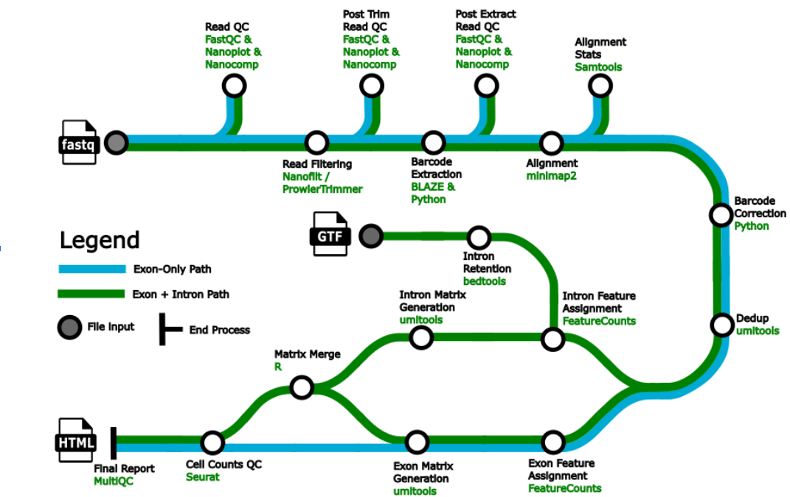

#  

[](https://nf-co.re/scnanoseq/results)[](https://doi.org/10.5281/zenodo.XXXXXXX)

[](https://www.nextflow.io/)
[](https://docs.conda.io/en/latest/)
[](https://www.docker.com/)
[](https://sylabs.io/docs/)
[](https://tower.nf/launch?pipeline=https://github.com/nf-core/scnanoseq)

[](https://nfcore.slack.com/channels/scnanoseq)[](https://twitter.com/nf_core)[](https://mstdn.science/@nf_core)[](https://www.youtube.com/c/nf-core)

## Introduction

**nf-core/scnanoseq** is a bioinformatics best-practice analysis pipeline for 10X Genomics single-cell/nuclei RNA-seq for data derived from Oxford Nanopore Q20+ chemistry ([R10.4 flow cells (>Q20)](https://nanoporetech.com/about-us/news/oxford-nanopore-announces-technology-updates-nanopore-community-meeting)). Due to the expectation of >Q20 quality, the input data for the pipeline is not dependent on Illumina paired data.

<!-- TODO: after test write brief sentence on exon only vs intron method (1 and 2) --->

The pipeline is built using [Nextflow](https://www.nextflow.io), a workflow tool to run tasks across multiple compute infrastructures in a very portable manner. It uses Docker/Singularity containers making installation trivial and results highly reproducible. The [Nextflow DSL2](https://www.nextflow.io/docs/latest/dsl2.html) implementation of this pipeline uses one container per process which makes it much easier to maintain and update software dependencies. Where possible, these processes have been submitted to and installed from [nf-core/modules](https://github.com/nf-core/modules) in order to make them available to all nf-core pipelines, and to everyone within the Nextflow community!

<!-- TODO nf-core: Add full-sized test dataset and amend the paragraph below if applicable -->

On release, automated continuous integration tests run the pipeline on a full-sized dataset on the AWS cloud infrastructure. This ensures that the pipeline runs on AWS, has sensible resource allocation defaults set to run on real-world datasets, and permits the persistent storage of results to benchmark between pipeline releases and other analysis sources. The results obtained from the full-sized test can be viewed on the [nf-core website](https://nf-co.re/scnanoseq/results).

## Pipeline summary



1. Raw read QC ([`FastQC`](https://www.bioinformatics.babraham.ac.uk/projects/fastqc/), [`NanoPlot`](https://github.com/wdecoster/NanoPlot) and [`NanoComp`](https://github.com/wdecoster/nanocomp))
2. Unzip and split FastQ ([`gunzip`](https://linux.die.net/man/1/gunzip))
   1. Optional: Split fastq for faster processing ([`split`](https://linux.die.net/man/1/split))
3. Trim and filter reads. ([`Nanofilt`](https://github.com/wdecoster/nanofilt))
4. Post trim QC ([`FastQC`](https://www.bioinformatics.babraham.ac.uk/projects/fastqc/), [`NanoPlot`](https://github.com/wdecoster/NanoPlot))
5. Barcode detection using a custom whitelist or 10X whitelist. [`BLAZE`](https://github.com/shimlab/BLAZE)
6. Extract barcodes. Consists of the following steps:
   1. Parse FASTQ files into R1 reads containing barcode and UMI and R2 reads containing sequencing without barcode and UMI (custom script `./bin/pre_extract_barcodes.py`)
   2. Re-zip FASTQs ([`pigz`](https://github.com/madler/pigz))
7. Post-extraction QC ([`FastQC`](https://www.bioinformatics.babraham.ac.uk/projects/fastqc/), [`NanoPlot`](https://github.com/wdecoster/NanoPlot))
8. Alignment ([`minimap2`](https://github.com/lh3/minimap2))
9. SAMtools processing including ([`SAMtools`](http://www.htslib.org/doc/samtools.html)):
    1. SAM to BAM
    2. Filtering of mapped only reads
    3. Sorting, indexing and obtain mapping metrics
10. Post-mapping QC in unfiltered BAM files ([`NanoComp`](https://github.com/wdecoster/nanocomp), [`RSeQC`](https://rseqc.sourceforge.net/))
11. Barcode tagging with read quality, BC, BC quality, UMI, and UMI quality (custom script `./bin/tag_barcodes.py`)
12. Barcode correction (custom script `./bin/correct_barcodes.py`)
13. Post correction QC for corrected bams ([`SAMtools`](http://www.htslib.org/doc/samtools.html))
14. UMI-based deduplication [`UMI-tools`](https://github.com/CGATOxford/UMI-tools)
15. Gene and transcript level matrices generation. [`IsoQuant`](https://github.com/ablab/IsoQuant)
16. Preliminary matrix QC ([`Seurat`](https://github.com/satijalab/seurat))
17. Present QC for raw reads, trimmed reads, pre and post-extracted reads, mapping metrics and preliminary single-cell/nuclei QC ([`MultiQC`](http://multiqc.info/))

## Usage

> **Note**
> If you are new to Nextflow and nf-core, please refer to [this page](https://nf-co.re/docs/usage/installation) on how
> to set-up Nextflow. Make sure to [test your setup](https://nf-co.re/docs/usage/introduction#how-to-run-a-pipeline)
> with `-profile test` before running the workflow on actual data.

First, prepare a samplesheet with your input data that looks as follows:

`samplesheet.csv`:

```csv
sample,fastq_1,cell_count
CONTROL_REP1,AEG588A1_S1_L002_R1_001.fastq.gz,1000
CONTROL_REP1,AEG588A1_S2_L002_R1_001.fastq.gz,1000
CONTROL_REP2,AEG588A2_S1_L002_R1_001.fastq.gz,1000
CONTROL_REP3,AEG588A3_S1_L002_R1_001.fastq.gz,1000
CONTROL_REP4,AEG588A4_S1_L002_R1_001.fastq.gz,1000
CONTROL_REP4,AEG588A4_S2_L002_R1_001.fastq.gz,1000
CONTROL_REP4,AEG588A4_S3_L002_R1_001.fastq.gz,1000
```

Each row represents a single-end fastq file. Rows with the same sample identifier are considered technical replicates and will be automatically merged. cell_count refers to the expected number of cells you expect

```bash
nextflow run nf-core/scnanoseq \
   -profile <docker/singularity/.../institute> \
   --input samplesheet.csv \
   --outdir <OUTDIR>
```

> **Warning:**
> Please provide pipeline parameters via the CLI or Nextflow `-params-file` option. Custom config files including those
> provided by the `-c` Nextflow option can be used to provide any configuration _**except for parameters**_;
> see [docs](https://nf-co.re/usage/configuration#custom-configuration-files).

For more details and further functionality, please refer to the [usage documentation](https://nf-co.re/scnanoseq/usage) and the [parameter documentation](https://nf-co.re/scnanoseq/parameters).

## Pipeline output

To see the results of an example test run with a full size dataset refer to the [results](https://nf-co.re/scnanoseq/results) tab on the nf-core website pipeline page.
For more details about the output files and reports, please refer to the
[output documentation](https://nf-co.re/scnanoseq/output).

This pipeline produces feature barcode matrices at both the gene and transcript level and can retain introns within the counts themselves. These files are able to be ingested directly by most packages used for downstream analyses such as Seurat. In addition the pipeline produces a number of quality control metrics to assess in ensuring the confidence of the results of the samples that were processed.

## Credits

nf-core/scnanoseq was originally written by [Austyn Trull](https://github.com/atrull314), and [Dr. Lara Ianov](https://github.com/lianov).

We thank the following people for their extensive assistance in the development of this pipeline:

We would also like to thank the following people and groups for their support, including financial support:

- Dr. Elizabeth Worthey
- University of Alabama at Birmingham Biological Data Science Core (U-BDS), RRID:SCR_021766, https://github.com/U-BDS

<!-- TODO from Lara: check that all financial support has been stated -->

## Contributions and Support

If you would like to contribute to this pipeline, please see the [contributing guidelines](.github/CONTRIBUTING.md).

For further information or help, don't hesitate to get in touch on the [Slack `#scnanoseq` channel](https://nfcore.slack.com/channels/scnanoseq) (you can join with [this invite](https://nf-co.re/join/slack)).

## Citations

<!-- TODO nf-core: Add citation for pipeline after first release. Uncomment lines below and update Zenodo doi and badge at the top of this file. -->
<!-- If you use  nf-core/scnanoseq for your analysis, please cite it using the following doi: [10.5281/zenodo.XXXXXX](https://doi.org/10.5281/zenodo.XXXXXX) -->

An extensive list of references for the tools used by the pipeline can be found in the [`CITATIONS.md`](CITATIONS.md) file.

You can cite the `nf-core` publication as follows:

> **The nf-core framework for community-curated bioinformatics pipelines.**
>
> Philip Ewels, Alexander Peltzer, Sven Fillinger, Harshil Patel, Johannes Alneberg, Andreas Wilm, Maxime Ulysse Garcia, Paolo Di Tommaso & Sven Nahnsen.
>
> _Nat Biotechnol._ 2020 Feb 13. doi: [10.1038/s41587-020-0439-x](https://dx.doi.org/10.1038/s41587-020-0439-x).
