# nf-core/scnanoseq: Output

## Introduction

This document describes the output produced by the pipeline. Most of the plots are taken from the MultiQC report, which summarises results at the end of the pipeline.

The directories listed below will be created in the results directory after the pipeline has finished. All paths are relative to the top-level results directory.

## Pipeline overview

The pipeline is built using [Nextflow](https://www.nextflow.io/) and processes data using the following steps:

- [Preprocessing](#preprocessing)
  - [Nanofilt](#nanofilt) - Read Quality Filtering and Trimming
- [Barcode Calling](#barcode-calling)
  - [BLAZE](#blaze) - Barcode caller
- [Alignment](#alignment)
  - [Minimap2](#minimap2) - Long read alignment
- [Alignment Post-processing](#alignment-post-processing)
  - [Samtools](#samtools) - Sort and index alignments and make alignment qc
  - [Barcode Tagging](#barcode-tagging) - Barcode tagging with quality metrics and barcode information
  - [UMI-tools Dedup](#umi-tools-dedup) - UMI-based Read deduplication
  - [Picard MarkDuplicates](#picard-markduplicates) - Read deduplication
- [Feature-Barcode Quantification](#feature-barcode-quantification)
  - [IsoQuant](#isoquant) - Feature-barcode quantification (gene and transcript level)
  - [oarfish](#oarfish) - Feature-barcode quantification (transcript-level only)
  - [Seurat](#seurat) - Feature-barcode matrix QC
- [Other steps](#other-steps)
  - [UCSC](#ucsc) - Annotation BED file
- [Quality Control](#quality-control)
  - [FastQC](#fastqc) - FASTQ QC
  - [NanoComp](#nanocomp) - Long Read FASTQ QC
  - [NanoPlot](#nanoplot) - Long Read FASTQ QC
  - [ToulligQC](#toulligqc) - Long Read FASTQ QC
  - [RSeQC](#rseqc) - Various RNA-seq QC metrics
  - [Read Counts](#read-counts) - Read Counts QC
  - [MultiQC](#multiqc) - Aggregate report describing results and QC from the whole pipeline
- [Pipeline information](#pipeline-information) - Report metrics generated during the workflow execution

## Preprocessing

### Nanofilt

<details markdown="1">
<summary>Output files</summary>

- `<sample_identifier>/`
  - `fastq/`
    - `trimmed_nanofilt/`
      - `*_filtered.fastq.gz`: The post-trimmed fastq. By default this will be mostly quality trimmed.

</details>

[Nanofilt](https://github.com/wdecoster/nanofilt) is a tool used for filtering and trimming of long read sequencing data.

## Barcode Calling

### BLAZE

<details markdown="1">
<summary>Output files</summary>

- `<sample_identifier>/`
  - `blaze/`
    - `blaze/*.bc_count.txt` : This is a file containing each barcode and the counts of how many reads support it.
    - `blaze/*.knee_plot.png` : The knee plot detailing the ranking of each barcode.
    - `blaze/*.putative_bc.csv` : This file contains the naively detected barcode for each read.
    - `blaze/*.whitelist.csv` : This is a list of the "true" barcodes detected for a sample. The length of the file should roughly match the expected amount of cells that is expected for the sample.

</details>

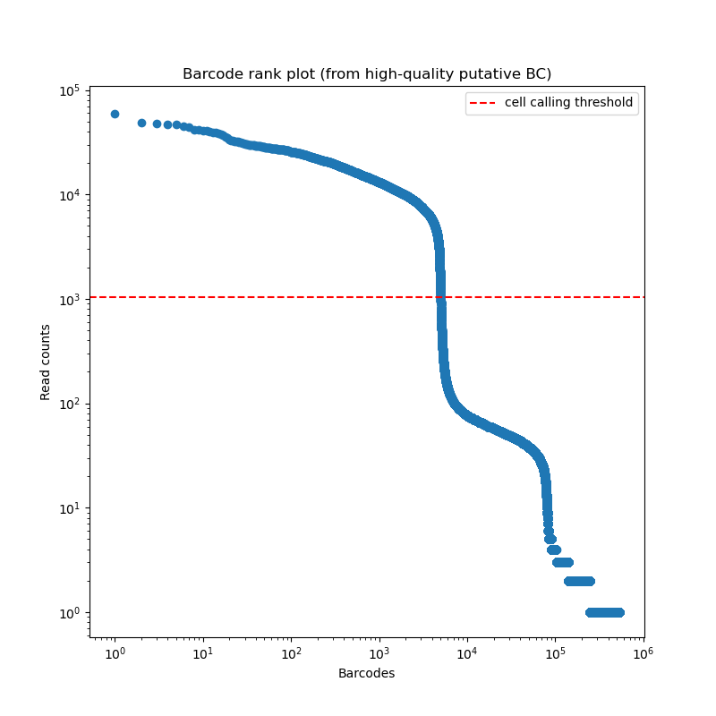

[BLAZE](https://github.com/shimlab/BLAZE) enables the accurate identification of barcodes and UMIs from Nanopore reads. The files produced by BLAZE can be used to assess the quality of the barcode calling and the data.

The knee plot (an example is listed above) that is provided by BLAZE shows all barcodes detected in a sample, ranked from highest to lowest read count. The "cliff-and-knee" shape (similar to the image above) is indicative of good quality. Deviations from this shape can be indicative of concerns with the data, such as low barcode counts. The `*.bc_count.txt` file can be used to accompany this figure to show every barcode and its abundance in the dataset.

## Alignment

### Minimap2

<details markdown="1">
<summary>Output files</summary>

- `<sample_identifier>/`
  - `genome`
    - `bam/`
      - `original/`
        - `*.sorted.bam` : The genome mapped and sorted bam.
        - `*.sorted.bam.bai` : The bam index for the genome mapped and sorted bam.
  - `transcriptome`
    - `bam/`
      - `original/`
      - `*.sorted.bam` : The transcriptome mapped and sorted bam.
      - `*.sorted.bam.bai` : The bam index for the transcriptome mapped and sorted bam.

</details>

[Minimap2](https://github.com/lh3/minimap2) is a versatile sequence alignment program that aligns DNA or mRNA sequences against a large reference database. Minimap2 is optimized for large, noisy reads making it a staple for alignment of nanopore reads.

## Alignment Post-processing

### Samtools

<details markdown="1">
<summary>Output files</summary>

- `<sample_identifier>/`
  - `genome/`
    - `bam/`
      - `mapped_only/`
        - `*.sorted.bam` : The genome aligned bam containing only reads that were able to be mapped.
        - `*.sorted.bam.bai` : The genome aligned bam index for the bam containing only reads that were able to be mapped.
    - `qc/`
      - `samtools/`
        - `minimap/`
          - `*.minimap.flagstat` : The flagstat file for the genome aligned bam obtained from minimap.
          - `*.minimap.idxstats` : The idxstats file for the genome aligned bam obtained from minimap.
          - `*.minimap.stats` : The stats file for the genome aligned bam obtained from minimap.
        - `mapped_only/`
          - `*.mapped_only.flagstat` : The flagstat file for the genome aligned bam containing only mapped reads.
          - `*.mapped_only.idxstats` : The idxstats file for the genome aligned bam containing only mapped reads.
          - `*.mapped_only.stats` : The stats file for the genome aligned bam containing only mapped reads.
        - `dedup/`
          - `*.dedup.flagstat` : The flagstat file for the genome aligned bam containing deduplicated umis.
  - `transcriptome/`
    - `bam/`
      - `mapped_only/`
        - `*.sorted.bam` : The transcriptome aligned bam containing only reads that were able to be mapped.
        - `*.sorted.bam.bai` : The transcriptome aligned bam index for the bam containing only reads that were able to be mapped.
    - `qc/`
      - `samtools/`
        - `minimap/`
          - `*.minimap.flagstat` : The flagstat file for the transcriptome aligned bam obtained from minimap.
          - `*.minimap.idxstats` : The idxstats file for the transcriptome aligned bam obtained from minimap.
          - `*.minimap.stats` : The stats file for the transcriptome aligned bam obtained from minimap.
        - `mapped_only/`
          - `*.mapped_only.flagstat` : The flagstat file for the transcriptome aligned bam containing only mapped reads.
          - `*.mapped_only.idxstats` : The idxstats file for the transcriptome aligned bam containing only mapped reads.
          - `*.mapped_only.stats` : The stats file for the transcriptome aligned bam containing only mapped reads.
        - `dedup/`
          - `*.dedup.flagstat` : The flagstat file for the transcriptome aligned bam containing deduplicated umis.

</details>

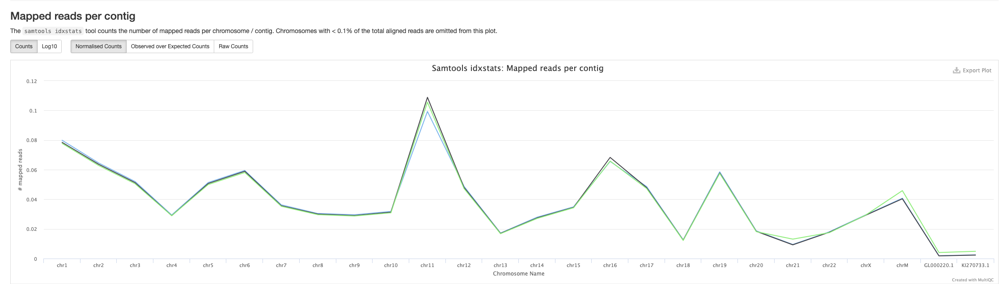
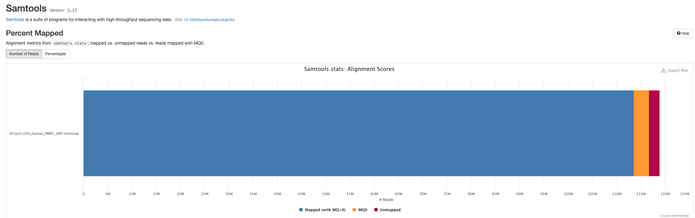

[Samtools](https://www.htslib.org/) is a suite of programs for reading, writing, editing, indexing, and viewing files that are in SAM, BAM, or CRAM format

### Barcode Tagging

<details markdown="1">
<summary>Output files</summary>

- `<sample_identifier>/`
  - `genome/`
    - `bam/`
      - `barcode_tagged/`
        - `*.tagged.bam` : The genome aligned bam containing tagged barcode and UMI metadata.
  - `transcriptome/`
    - `bam/`
      - `barcode_tagged/`
        - `*.tagged.bam` : The transcriptome aligned bam containing tagged barcode and UMI metadata.

</details>

Barcode tagging is a custom script which adds metadata to the BAM files with commonly used single-cell tags which can be useful for custom down stream analysis (e.g.: subsetting BAMs based on cell barcodes). Specifically the following tags are added:

```
barcode tag = "CR"
barcode quality tag = "CY"
UMI tag = "UR"
UMI quality tag = "UY"
```

Please see [Barcode Correction](#barcode-correction) below for metadata added post-correction.

### UMI-tools Dedup

<details markdown="1">
<summary>Output files</summary>

- `<sample_identifier>/`
  - `genome/`
    - `bam/`
      - `dedup_umitools/`
        - `*.dedup.bam` : The genome aligned bam containing corrected barcodes and deduplicated umis.
        - `*.dedup.bam.bai` : The genome aligned bam index for the bam containing corrected barcodes and deduplicated umis.
  - `transcriptome/`
    - `bam/`
      - `dedup_umitools/`
        - `*.dedup.bam` : The transcriptome aligned bam containing corrected barcodes and deduplicated umis.
        - `*.dedup.bam.bai` : The transcriptome aligned bam index for the bam containing corrected barcodes and deduplicated umis.

</details>

[UMI-Tools](https://umi-tools.readthedocs.io/en/latest/reference/dedup.html) deduplicate reads based on the mapping co-ordinate and the UMI attached to the read. The identification of duplicate reads is performed in an error-aware manner by building networks of related UMIs.

Users should note that `oarfish` requires input reads to be deduplicated. As a result, the `skip_dedup` option is only applicable to `IsoQuant`. By default, `scnanoseq` will perform deduplication for IsoQuant unless the `skip_dedup` option is explicitly enabled, while deduplication will always be executed for `oarfish` quantification.

### Picard MarkDuplicates

<details markdown="1">
<summary>Output files</summary>

- `<sample_identifier>/`
  - `genome/`
    - `bam/`
      - `dedup_picard/`
        - `*.dedup.bam` : The genome aligned bam containing corrected barcodes and deduplicated umis.
        - `*.dedup.bam.bai` : The genome aligned bam index for the bam containing corrected barcodes and deduplicated umis.
  - `transcriptome/`
    - `bam/`
      - `dedup_picard/`
        - `*.dedup.bam` : The transcriptome aligned bam containing corrected barcodes and deduplicated umis.
        - `*.dedup.bam.bai` : The transcriptome aligned bam index for the bam containing corrected barcodes and deduplicated umis.

</details>

[Picard MarkDuplicates](https://gatk.broadinstitute.org/hc/en-us/articles/360037052812-MarkDuplicates-Picard) locates and tags duplicate reads in a BAM or SAM file.

Users should note that `oarfish` requires input reads to be deduplicated. As a result, the `skip_dedup` option is only applicable to `IsoQuant`. By default, `scnanoseq` will perform deduplication for IsoQuant unless the `skip_dedup` option is explicitly enabled, while deduplication will always be executed for `oarfish` quantification.

## Feature-Barcode Quantification

### IsoQuant

<details markdown="1">
<summary>Output files</summary>

- `<sample_identifier>/`
  - `genome/`
    - `isoquant/`
      - `*.gene_counts.tsv` : The feature-barcode matrix from gene quantification.
      - `*.transcript_counts.tsv` : The feature-barcode matrix from transcript quantification.

</details>

[IsoQuant](https://github.com/ablab/IsoQuant) is a tool for the genome-based analysis of long RNA reads, such as PacBio or Oxford Nanopores. IsoQuant allows to reconstruct and quantify transcript models with high precision and decent recall. If the reference annotation is given, IsoQuant also assigns reads to the annotated isoforms based on their intron and exon structure. IsoQuant further performs annotated gene, isoform, exon and intron quantification. The outputs of IsoQuant can be important for downstream analysis with tools specialized in single-cell/nuclei analysis (e.g.: `Seurat`).

In order to assist with the performance of IsoQuant, the inputs are split by chromosome to add a further degree of parallelization.

It should also be noted that IsoQuant can only accurately perform quantification on a **genome** aligned bam, and will produce both gene and transcript level matrices

### oarfish

<details markdown="1">
<summary>Output files</summary>

- `<sample_identifier>/`
  - `transcriptome/`
    - `oarfish/`
      - `barcodes.tsv.gz`
      - `features.tsv.gz`
      - `matrix.mtx.gz`

</details>

[oarfish](https://github.com/COMBINE-lab/oarfish) is a program, written in Rust (https://www.rust-lang.org/), for quantifying transcript-level expression from long-read (i.e. Oxford nanopore cDNA and direct RNA and PacBio) sequencing technologies. oarfish requires a sample of sequencing reads aligned to the transcriptome (currently not to the genome). It handles multi-mapping reads through the use of probabilistic allocation via an expectation-maximization (EM) algorithm.

It should also be noted that oarfish can only accurately perform quantification on a **transcript** aligned bam, and will only produce transcript level matrices. It's also recommended to ensure that the `--save_transcript_secondary_alignment` is enabled to produce the most accurate oarfish results (true by default for `oarfish` quantification). Notably, this can lead to much higher number of reads reported as aligned, however, this is expected behavior when secondary alignments are included in the analysis.

### Seurat

<details markdown="1">
<summary>Output files</summary>

- `<sample_identifier>/`
  - `genome/`
    - `qc/`
      - `gene/`
        - `*.csv`: A file containing statistics about the isoquant generated cell-read distribution for genes.
        - `*.png`: A series of qc images to determine the quality of the isoquant generated gene quantification.
      - `transcript/`
        - `*.csv`: A file containing statistics about the isoquant generated cell-read distribution for transcripts.
        - `*.png`: A series of qc images to determine the quality of the isoquant generated transcript quantification.
  - `transcriptome/`
    - `qc/`
      - `transcript/`
        - `*.csv`: A file containing statistics about the oarfish generated cell-read distribution for transcript.
        - `*.png`: A series of qc images to determine the quality of the oarfish generated transcript quantification.

</details>

[Seurat](https://satijalab.org/seurat/) is an R package designed for QC, analysis, and exploration of single-cell RNA-seq data.

## Other steps

### UCSC

<details markdown="1">
<summary>Output files</summary>

- `ucsc/`
  - `*.annotation.bed`: BED file format from input GTF
  - `*.annotation.genepred`: genepred file format from input GTF

</details>

[`ucsc-gtftogenepred` and `ucsc-genepredtobed`](https://hgdownload.cse.ucsc.edu/admin/exe/linux.x86_64/) are stand-alone applications developed by UCSC which, together, converts a GTF file the BED file format.

## Quality Control

### FastQC

<details markdown="1">
<summary>Output files</summary>

- `<sample_identifier>/`
  - `qc/`
    - `fastqc/`
      - `pre_trim/` and `post_trim/` and `post_extract/`
        - `*_fastqc.html`: FastQC report containing quality metrics.
        - `*_fastqc.zip`: Zip archive containing the FastQC report, tab-delimited data file and plot images.

</details>

[FastQC](http://www.bioinformatics.babraham.ac.uk/projects/fastqc/) gives general quality metrics about your sequenced reads. It provides information about the quality score distribution across your reads, per base sequence content (%A/T/G/C), adapter contamination and overrepresented sequences. For further reading and documentation see the [FastQC help pages](http://www.bioinformatics.babraham.ac.uk/projects/fastqc/Help/).

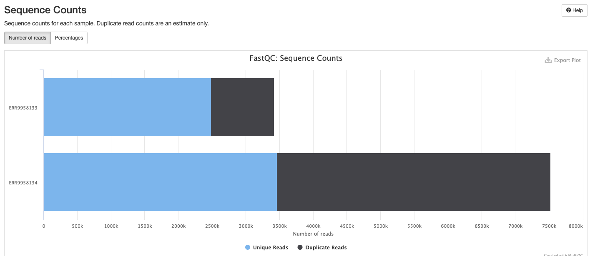

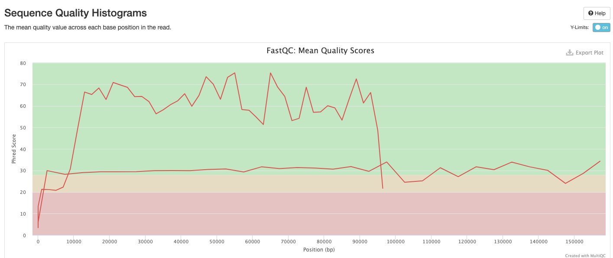

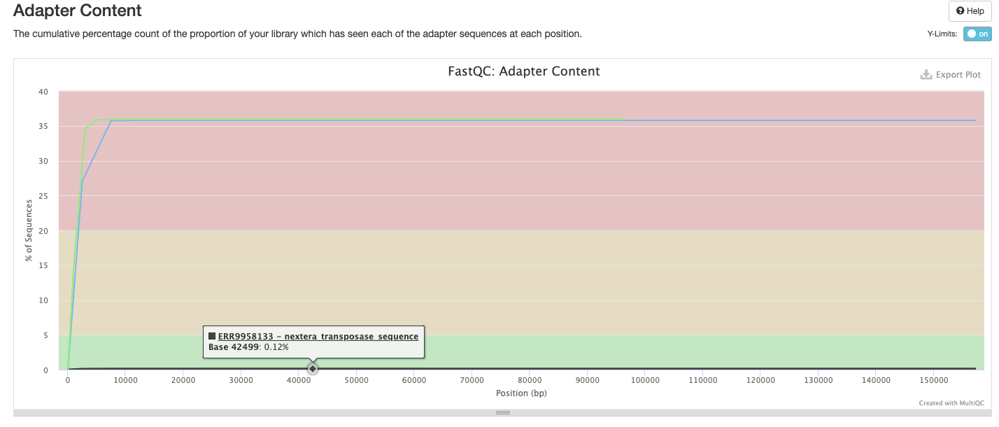

:::note
The FastQC plots displayed in the MultiQC report shows _untrimmed_ reads. They may contain adapter sequence and potentially regions with low quality.
:::

### NanoComp

<details markdown="1">
<summary>Output files</summary>

- `batch_qcs/`
  - `nanocomp/`
    - `fastq/`
      - `NanoComp_*.log`: This is the log file detailing the nanocomp run.
      - `NanoComp-report.html` - This is browser-viewable report that contains all the figures in a single location.
      - `*.html`: Nanocomp outputs all the figures in the report as individual files that can be inspected separately.
      - `NanoStats.txt`: This file contains quality control statistics about the dataset.
  - `genome`
    - `nanocomp/`
      - `bam/`
        - `NanoComp_*.log`: This is the log file detailing the nanocomp run.
        - `NanoComp-report.html` - This is browser-viewable report that contains all the figures in a single location.
        - `*.html`: Nanocomp outputs all the figures in the report as individual files that can be inspected separately.
        - `NanoStats.txt`: This file contains quality control statistics about the dataset.
  - `transcriptome`
    - `nanocomp/`
      - `bam/`
        - `NanoComp_*.log`: This is the log file detailing the nanocomp run.
        - `NanoComp-report.html` - This is browser-viewable report that contains all the figures in a single location.
        - `*.html`: Nanocomp outputs all the figures in the report as individual files that can be inspected separately.
        - `NanoStats.txt`: This file contains quality control statistics about the dataset.

</details>

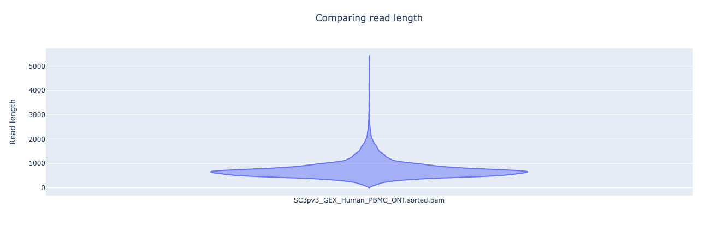
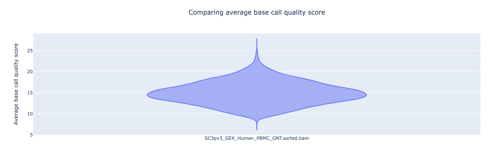

[NanoComp](https://github.com/wdecoster/nanocomp) compares multiple runs of long read sequencing data and alignments. It creates violin plots or box plots of length, quality and percent identity and creates dynamic, overlaying read length histograms and a cumulative yield plot

### NanoPlot

<details markdown="1">
<summary>Output files</summary>

- `<sample_identifier>/`
  - `qc/`
    - `nanoplot/`
      - `pre_trim/` and `post_trim/` and `post_extract/`
        - `NanoPlot_*.log`: This is the log file detailing the nanoplot run
        - `NanoPlot-report.html` - This is browser-viewable report that contains all the figures in a single location.
        - `*.html`: Nanoplot outputs all the figures in the report as individual files that can be inspected separately.
        - `NanoStats.txt`: This file contains quality control statistics about the dataset.
        - `NanoStats_post_filtering.txt`: If any filtering metrics are used for nanoplot this will contain the differences. This is produced by default and should contain no differences from `NanoStats.txt` if the process was unmodified

</details>

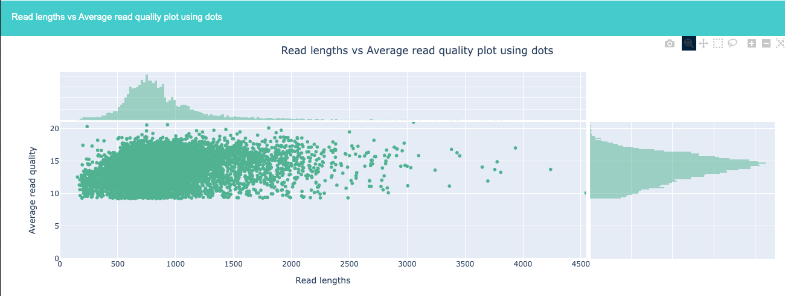
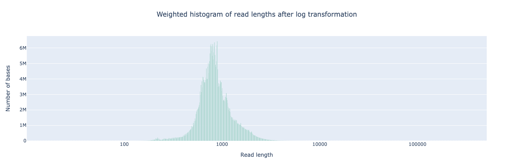

[NanoPlot](https://github.com/wdecoster/NanoPlot) is a plotting tool for long read sequencing data and alignments.

### ToulligQC

<details markdown="1">
<summary>Output files</summary>

- `<sample_identifier>/`
  - `qc/`
    - `toulligqc/`
      - `pre_trim/` and `post_trim/` and `post_extract/`
        - `<sample_identifier>ToulligQC-report-<date>/`
          - `report.html`: This is browser-viewable report that contains all the figures in a single location.
          - `report.data`: A log file containing information about ToulligQC execution, environment variables and full statistics
          - `images/*`: This is folder containing all the individual images produced by ToulligQC

</details>

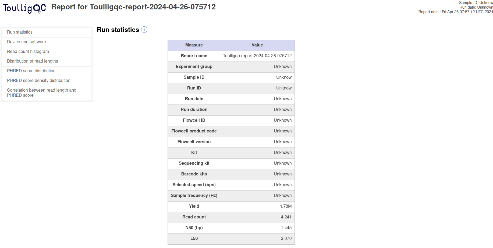
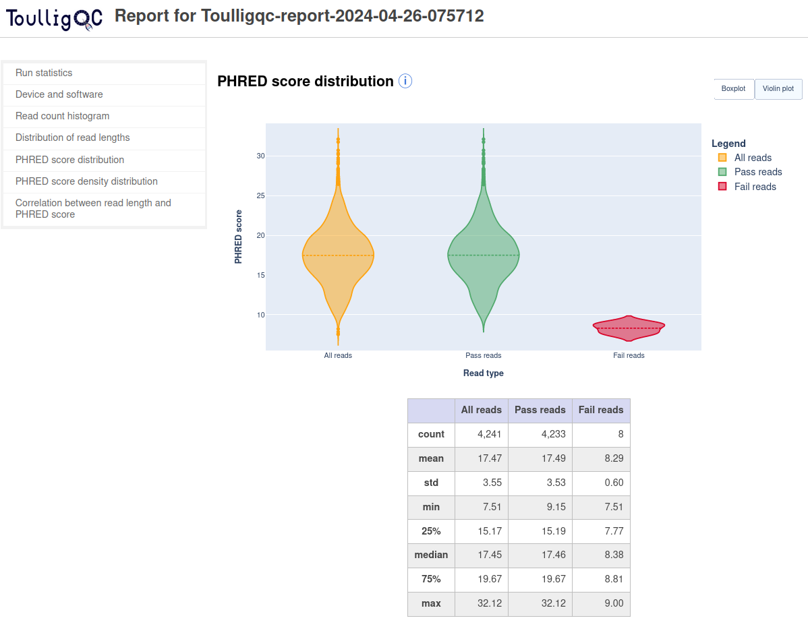

[ToulligQC](https://github.com/GenomiqueENS/toulligQC) is a post sequencing QC tool for Oxford Nanopore sequencers.

### RSeQC

<details markdown="1">
<summary>Output files</summary>

- `<sample_identifier>/`
  - `qc/`
    - `rseqc/`
      - `*.read_distribution.txt`: This file contains statistics noting the type of reads located within the dataset

</details>

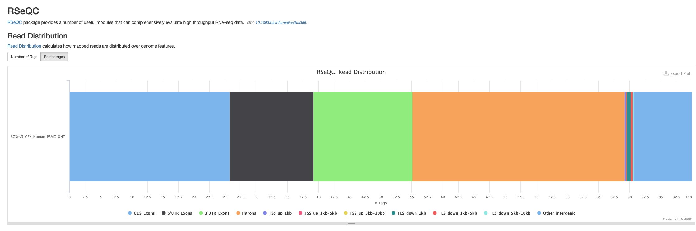

[RSeQC](https://rseqc.sourceforge.net/) package provides a number of useful modules that can comprehensively evaluate high throughput sequence data especially RNA-seq data.

### Read Counts

<details markdown="1">
<summary>Output files</summary>

- `batch_qcs/`
  - `read_counts/`
    - `read_counts.csv`: This file contains the read counts for each sample at various points in the pipeline. Each row is a different sample, and the columns are the amount of reads the sample contained at that point in the pipeline.

</details>

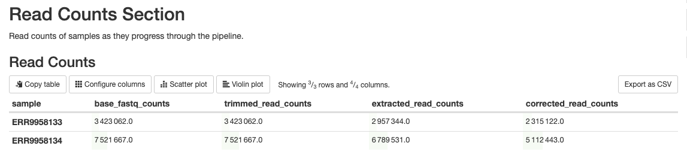

This is a custom script written using BASH scripting. Its purpose is to report the amount of reads that are filtered out at steps in the pipeline that will result in filtered reads, such as barcode detection, barcode correction, alignment, etc. Elevated levels of filtering can be indicative of quality concerns.

For performance, this step parses the read counts from the output of either FastQC or NanoPlot rather than computing it. If the options `--skip_fastqc` and `--skip_nanoplot` or `--skip_qc` is used, this file will not be produced.

### MultiQC

<details markdown="1">
<summary>Output files</summary>

- `multiqc/`
  - `multiqc_report.html`: a standalone HTML file that can be viewed in your web browser.
  - `multiqc_data/`: directory containing parsed statistics from the different tools used in the pipeline.
  - `multiqc_plots/`: directory containing static images from the report in various formats.

</details>

[MultiQC](http://multiqc.info) is a visualization tool that generates a single HTML report summarising all samples in your project. Most of the pipeline QC results are visualised in the report and further statistics are available in the report data directory.

Results generated by MultiQC collate pipeline QC from supported tools e.g. FastQC. The pipeline has special steps which also allow the software versions to be reported in the MultiQC output for future traceability. For more information about how to use MultiQC reports, see <http://multiqc.info>.

### Pipeline information

<details markdown="1">
<summary>Output files</summary>

- `pipeline_info/`
  - Reports generated by Nextflow: `execution_report.html`, `execution_timeline.html`, `execution_trace.txt` and `pipeline_dag.dot`/`pipeline_dag.svg`.
  - Reports generated by the pipeline: `pipeline_report.html`, `pipeline_report.txt` and `software_versions.yml`. The `pipeline_report*` files will only be present if the `--email` / `--email_on_fail` parameter's are used when running the pipeline.
  - Reformatted samplesheet files used as input to the pipeline: `samplesheet.valid.csv`.
  - Parameters used by the pipeline run: `params.json`.

</details>

[Nextflow](https://www.nextflow.io/docs/latest/tracing.html) provides excellent functionality for generating various reports relevant to the running and execution of the pipeline. This will allow you to troubleshoot errors with the running of the pipeline, and also provide you with other information such as launch commands, run times and resource usage.
